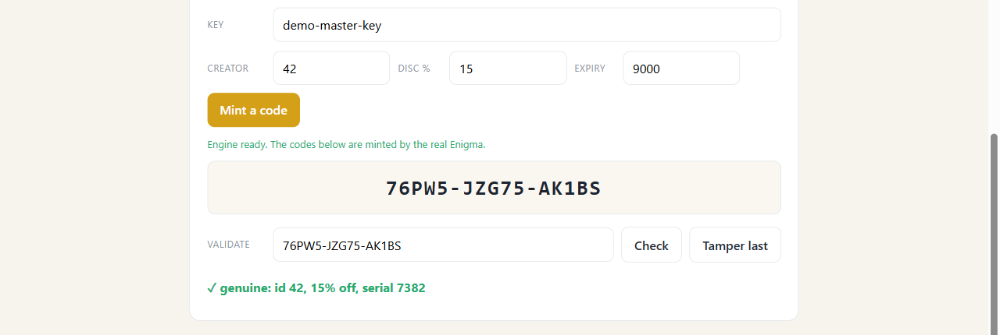

# EnigmaR

[](https://github.com/hjack-rw/EnigmaR/actions/workflows/ci.yml)

A home-grown **Enigma-style cipher**, put to one genuinely useful job:
**sealed, self-validating codes**. Short, pretty codes that carry their own data
and prove they're real, with *no database lookup* needed to check them.

> **[▶ Live demo](https://hjack-rw.github.io/EnigmaR/):** set the fields, mint a code, then tamper it and watch it reject. Runs entirely in your browser.

[](https://hjack-rw.github.io/EnigmaR/)

```
SUMMR-7F3QA-9   →  decode →  { creator: 42, discount: 15%, expiry, serial }   ✓ genuine
```

**A real use case, not a toy.** This fits anywhere you hand out codes that have to
prove themselves without a lookup: discount and coupon codes, gift cards, license
keys, event tickets, referral codes. The code *is* the record, so a till or a
turnstile can validate it offline, with no shared database behind it.

The security split is deliberate and stated up front: a standard **HMAC** seals the
code, and the Enigma gives it its shape and character. It's a home-grown cipher, so
it isn't a vault for real secrets, but it solves the stated problem and it's honest
about exactly where the strength comes from.

## The idea in one minute

An Enigma machine is a *keyed, reversible, format-preserving* permutation: it maps
symbols to symbols of the same alphabet, same length. That is exactly what a
**code that keeps its shape** needs. Wrap it around a payload plus an HMAC tag and
the code becomes:

- **unforgeable:** the HMAC tag rides *inside*, so you can't mint a valid one without the key
- **self-validating:** decode and recompute the tag; authenticity needs **no database**
- **self-describing:** the code carries its own fields (id, discount, expiry, serial)
- **tamper-evident:** flip one character and the tag fails
- **pretty:** grouped base32, looks like a normal code, not a blob

The honest split: **HMAC does the security, the Enigma does the format** (and a
per-key config gives each brand its own disjoint code space). Reversibility plus
format-preservation is the one thing the engine does that a one-way hash can't.

```python
from enigmar import FPE
card = FPE("key", "0123456789", nonce="card")
card.encrypt("4111 1111 1111 1111")     # another valid, same-shape card; spaces kept
```

## How it grew

Started as a **BSc-thesis companion project (2020)** on encryption in digital signal
processing, and kept going. The history lives in branches and tags:

| branch / tag | what it is |
|---|---|
| `thesis` / `v0-thesis` | the original 2020 Flask Enigma app, where it began |
| `engine` / `v1-engine` | the case-study engine: dynamics, DH handshake, ratchet, session, socket chat, tests, demos of usage. Taken far past what the codes need, as a study of how far the mechanism goes |
| `main` / `v2-codes` | **this**: the lean core (`enigmar/`) plus the live browser demo |

## Layout (this `main` branch: library and live demo)

```
enigmar/   machine · cipher · fpe     (the lean cipher core)
docs/      index.html · style.css · app.js · assets   (the live demo → GitHub Pages)
```

The `engine` branch carries the case-study build: the same engine pushed much
further than the codes require, with its test suite and runnable demos of usage.
It's deliberately overkill, kept as a playground for the mechanism rather than the
minimum the codes need.

## Honest boundaries

Home-grown and unreviewed, so for real secrets reach for a vetted cipher
(AES-GCM, ChaCha20). Within its own scope, though, the design earns its keep:

- **the payload doesn't crack cheaply:** every code carries its own nonce, so no two codes share a keystream and you can't read a batch by diffing them (that was a real weakness, and it's closed)
- **forging means forging the HMAC tag,** which means holding the key

Effective security is the entropy you inject, the random key, not the cleverness of
the machine. That is the load-bearing part. Rotating a tenant's key sits on top as a
clean bonus: do it once and every code ever issued under the old key dies at the
same moment.

Pure standard library, no dependencies. MIT licensed.
